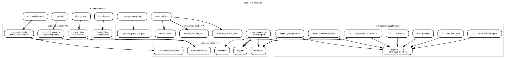

# API Contracts

Behavioral layer 5 for `eatme`: CLI entry points, library APIs, and the web-platform REST adapter exercised from `eatme-alice` tests.

## CLI surface

| Surface | Implementation handoff | Primary contract |
| --- | --- | --- |
| `deps check` | `eatme_alice::check_dependencies(&RealCommandRunner)` | `DependencyReport` |
| `alice discover` | `eatme_alice::discover_alice(&alice_home, &runner)` | `AliceDiscovery` |
| `alice package` | `eatme_alice::package_alice(PackageOptions, &runner)` | `PackageResult` |
| `alice launch-smoke` | `eatme_alice::run_launch_smoke(&LaunchSmokeOptions)` | `LaunchSmokeManifest` |
| `assets validate` | `validate_scenario_asset`, `validate_persona_crew`, or `validate_assets` | Validation report JSON |
| `assets generate-gadugi` | `eatme_assets::generate_gadugi_adapters(root, check)` | `GadugiAdapterGenerationReport` |

## Library surface

| Crate | Exported surface mapped here | Notes |
| --- | --- | --- |
| `eatme-alice` | `run_launch_smoke`, `discover_alice`, `check_dependencies`, `package_alice` | Public crate root re-exports consumed by `eatme-cli`. |
| `eatme-core` | `Program`, `Procedure`, `Statement`, `CommandRunner`, `LaunchSmokeManifest` | Shared contracts for grading and launch orchestration. |
| `eatme-assets` | `grade_sequencing`, `validate_scenario_asset`, `validate_persona_crew`, `validate_assets`, `generate_gadugi_adapters` | Validation + grading + adapter generation surfaces. |

## Web-platform adapter surface

| Endpoint | Request role in tests | Response/assertion contract |
| --- | --- | --- |
| `GET /api/health` | Probe server readiness | `HealthResponse` -> `StepResult` |
| `POST /api/launch` | Start template project | `LaunchResponse` |
| `POST /api/scene/add-object` | Add student object | `AddObjectResponse` |
| `POST /api/code/edit-procedure` | Apply learner code edits | `EditProcedureResponse` |
| `POST /api/world/run` | Run the world | `RunWorldResponse` |
| `POST /api/project/save` | Save project state | `SaveResponse` |
| `POST /api/events/register` | Register event handlers | `EventResponse` |

## Mermaid overview

## DOT overview

## Source files

- [api-contracts.mmd](api-contracts.mmd)
- [api-contracts.dot](api-contracts.dot)
