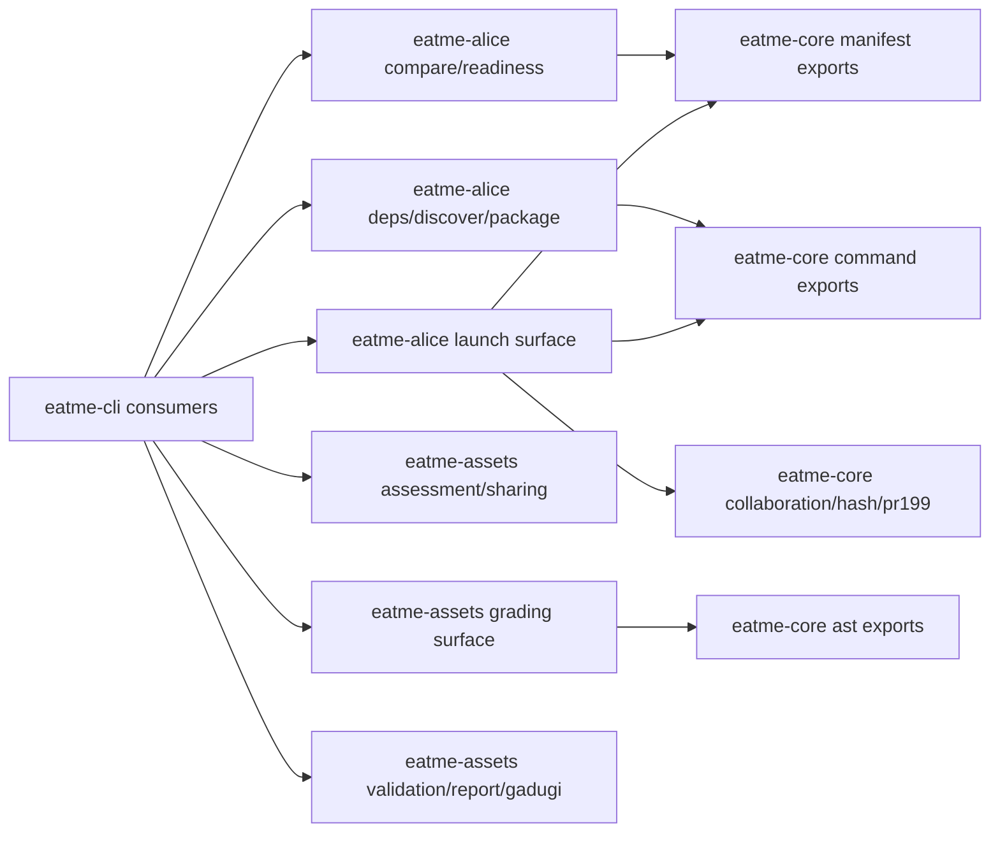
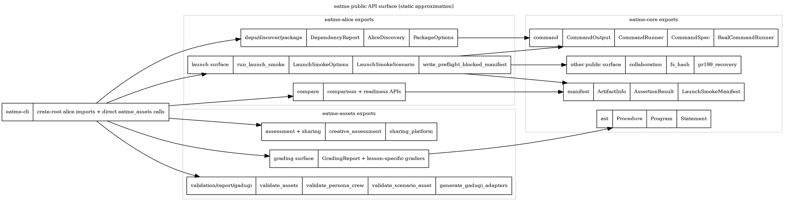

Mode: static-approximation

# AST+LSP Bindings

Static export map derived from `crates/*/src/lib.rs`, crate manifests, and `eatme-cli`
call sites. No LSP server was used; this layer is a static approximation of public symbol
boundaries and cross-crate consumers.

## Public API surface

| Crate | Public surface observed in `lib.rs` | Cross-crate binding notes |
| --- | --- | --- |
| `eatme-core` | Re-exports AST, collaboration, command, hash, and manifest types/functions; `pr199_recovery` remains a public module. | `eatme-alice` binds to command/manifest/hash helpers; `eatme-assets` binds to AST types. |
| `eatme-alice` | Re-exports comparison/readiness APIs, dependency checks, discovery, packaging, launch smoke orchestration, launch options, and scenarios. | `eatme-cli` imports these at the crate root and dispatches subcommands through them. |
| `eatme-assets` | Re-exports assessment, grading, quality scoring, sharing-platform, gadugi, and validation/report types; also exposes `validate_assets`. | `eatme-cli` calls validation and gadugi APIs directly; `grading.rs` also consumes grading helpers. |

## Consumption paths used for the approximation

- `crates/eatme-cli/src/main.rs` imports `eatme_alice::{...}` for deps, discovery, package,
  launch smoke, comparison, and readiness flows.
- `crates/eatme-cli/src/main.rs` calls `eatme_assets::validate_assets`,
  `validate_persona_crew`, `validate_scenario_asset`, and `generate_gadugi_adapters`.
- `crates/eatme-cli/src/grading.rs` combines `eatme_assets::validate_assets` and
  `eatme_assets::grade_first_lesson_readiness` with `eatme_alice::check_dependencies`.

## Mermaid

## DOT

## Source files

- [ast-lsp-bindings.mmd](ast-lsp-bindings.mmd)
- [ast-lsp-bindings.dot](ast-lsp-bindings.dot)
