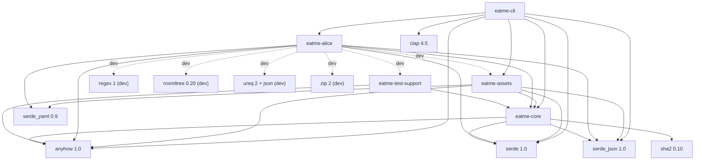
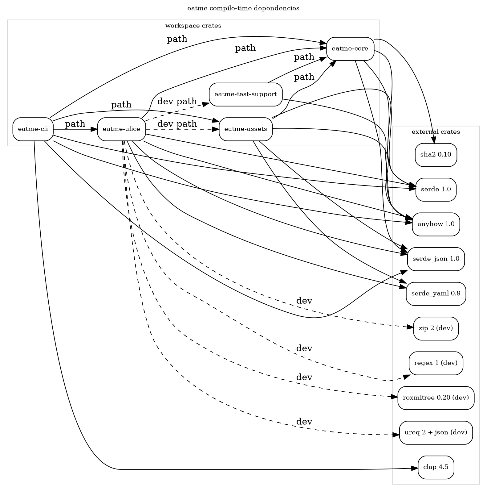

# Compile-time Dependencies

Direct dependency map derived from the root workspace manifest plus per-crate
`Cargo.toml` files for `eatme-core`, `eatme-alice`, `eatme-assets`, and `eatme-cli`.

## Manifest inventory

| Crate | Internal workspace deps | External deps | Dev-only deps |
| --- | --- | --- | --- |
| `eatme-core` | _none_ | `anyhow`, `serde`, `serde_json`, `sha2` | _none_ |
| `eatme-alice` | `eatme-core` | `anyhow`, `serde`, `serde_json`, `serde_yaml` | `eatme-assets`, `eatme-test-support`, `regex`, `roxmltree`, `ureq` (`json`), `zip` |
| `eatme-assets` | `eatme-core` | `anyhow`, `serde`, `serde_json`, `serde_yaml` | _none_ |
| `eatme-cli` | `eatme-alice`, `eatme-assets`, `eatme-core` | `anyhow`, `clap` (`derive`, `env`), `serde`, `serde_json` | _none_ |
| `eatme-test-support` | `eatme-core` | `anyhow` | _none_ |

Workspace-managed versions come from the root `Cargo.toml`: `anyhow 1.0`, `clap 4.5`,
`serde 1.0`, `serde_json 1.0`, `serde_yaml 0.9`, and `sha2 0.10`.

## Mermaid

## DOT

## Source files

- [compile-deps.mmd](compile-deps.mmd)
- [compile-deps.dot](compile-deps.dot)
