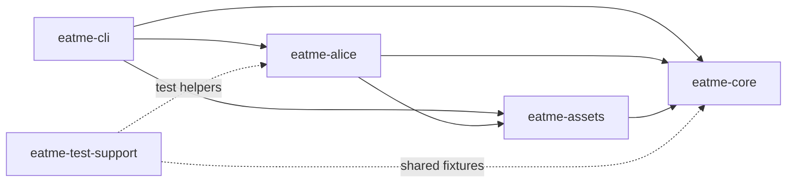
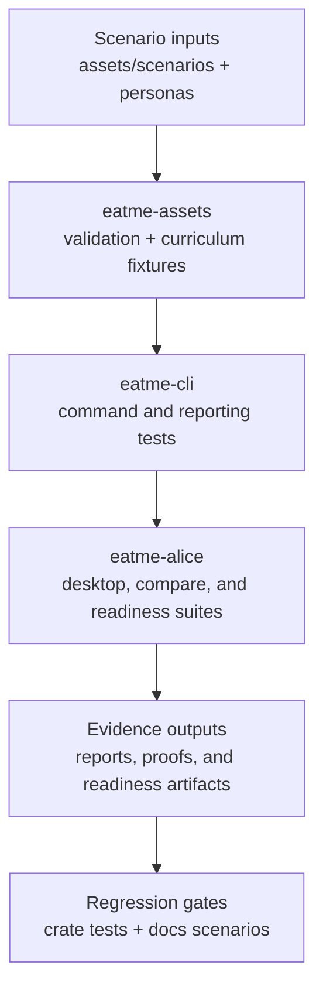

# Crate Dependencies

The eatme workspace centers on a CLI entrypoint, Alice execution adapters, reusable scenario assets, and shared core contracts.

## Workspace dependency map

## Scenario flow through tests

