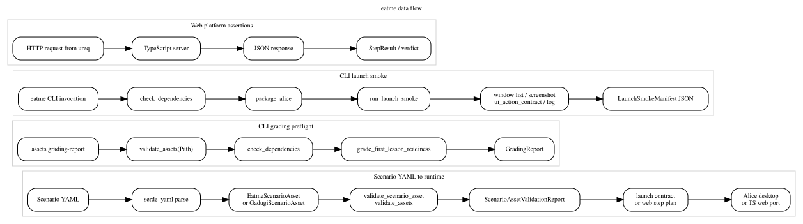

# Data Flow

Behavioral layer 6 maps the main artifact transformations in `eatme`: scenario assets, launch-smoke execution, grading preflight, and web-platform request loops.

## Flow inventory

| Flow | Start artifact | Main transforms | End artifact |
| --- | --- | --- | --- |
| Scenario runtime | Scenario YAML | YAML parse -> validation -> launch contract | Alice desktop or TS server run |
| Grading preflight | `assets grading-report` CLI invocation | `validate_assets` -> `check_dependencies` -> `grade_first_lesson_readiness` | `GradingReport` |
| Launch smoke | CLI invocation | dependency check -> package -> launch -> evidence capture | `LaunchSmokeManifest` |
| Web platform | HTTP request | request -> TS server -> JSON response -> assertions | `StepResult` / scenario verdict |

Current CLI grading is preflight-only: it does not parse `.a3p` files, read `program.xml`, or build an AST before producing the report.

## Mermaid overview

## DOT overview

## Source files

- [data-flow.mmd](data-flow.mmd)
- [data-flow.dot](data-flow.dot)
