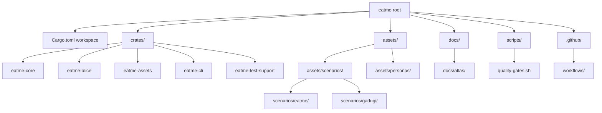
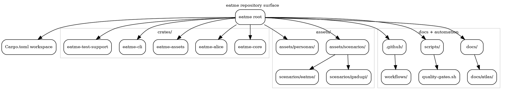

# Repository Surface

Top-level structural view of the repository root, centered on the Rust workspace,
committed asset trees, and the docs/automation surfaces requested for the atlas.

## Scope snapshot

| Surface | Observed structure | Notes |
| --- | --- | --- |
| Workspace crates | `eatme-core`, `eatme-alice`, `eatme-assets`, `eatme-cli`, `eatme-test-support` | Declared in the root `Cargo.toml` workspace. |
| Assets | `assets/scenarios/eatme/`, `assets/scenarios/gadugi/`, `assets/personas/` | Scenario YAML and persona crew assets are committed in-tree. |
| Documentation | `docs/`, including `docs/atlas/` | Atlas output nests inside the wider MkDocs docs tree. |
| Automation | `scripts/quality-gates.sh`, `.github/workflows/` | Local and CI entry points for validation/publishing. |

## Mermaid

## DOT

## Source files

- [repo-surface.mmd](repo-surface.mmd)
- [repo-surface.dot](repo-surface.dot)
