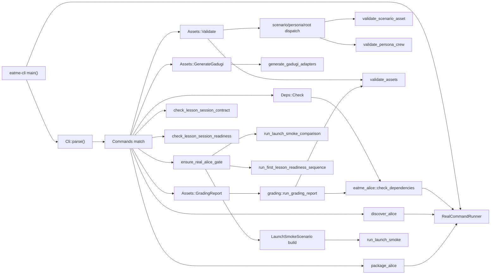
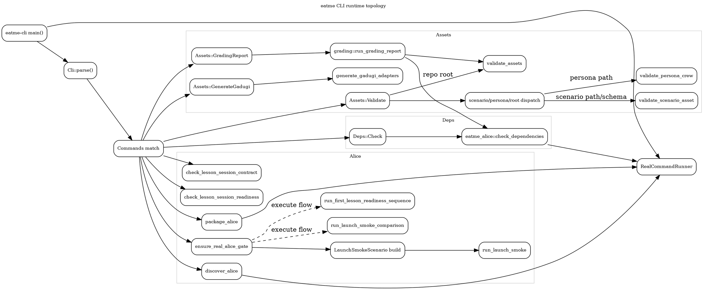

# Runtime Topology

Runtime view of the CLI dispatcher in `crates/eatme-cli/src/main.rs`, with focused detail
on the `deps`, `assets`, and `alice` command families and their crate-level handoffs.

## Flow notes

| Entry | Runtime handoff | Notes |
| --- | --- | --- |
| `Deps::Check` | `eatme_alice::check_dependencies(&RealCommandRunner)` | CLI instantiates the runner once in `main()`. |
| `Assets::Validate` | `validate_scenario_asset`, `validate_persona_crew`, or `validate_assets` | `is_scenario_asset_path()` routes scenario files to the stricter scenario validator. |
| `Assets::GenerateGadugi` | `generate_gadugi_adapters` | Emits or checks generated adapter YAML. |
| `Assets::GradingReport` | `grading::run_grading_report` | Internally combines `validate_assets` with `check_dependencies`. |
| `Alice::LaunchSmoke` | `ensure_real_alice_gate` -> `LaunchSmokeScenario` -> `run_launch_smoke` | Launch execution is the primary runtime handoff into `eatme-alice`. |
| `Alice::CompareLaunchSmoke` | Optional gate when `--execute`, then `run_launch_smoke_comparison` | Rebuilds comparison inputs before launch comparison. |
| `Alice::RunFirstLessonReadiness` | Optional execute gate -> `run_first_lesson_readiness_sequence` | Shares the same real-Alice gating pattern. |

## Mermaid

## DOT

## Source files

- [runtime-topology.mmd](runtime-topology.mmd)
- [runtime-topology.dot](runtime-topology.dot)
