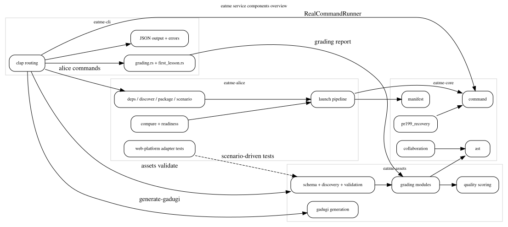

# Service Components

Behavioral layer 7 splits the workspace into crate-level component maps and one cross-crate DOT overview.

## Crate summaries

| Crate | Focus in this layer |
| --- | --- |
| `eatme-core` | Shared AST, command, manifest, and collaboration contracts |
| `eatme-alice` | Launch pipeline, comparison/readiness, and web-platform adapter harness |
| `eatme-assets` | Schema validation, scenario discovery, grading pipeline, and quality scoring |
| `eatme-cli` | Clap routing, helper modules, and output formatting |

## `eatme-core`

## `eatme-alice`

## `eatme-assets`

## `eatme-cli`

## DOT overview

## Source files

- [eatme-core.mmd](eatme-core.mmd)
- [eatme-alice.mmd](eatme-alice.mmd)
- [eatme-assets.mmd](eatme-assets.mmd)
- [eatme-cli.mmd](eatme-cli.mmd)
- [service-components.dot](service-components.dot)
