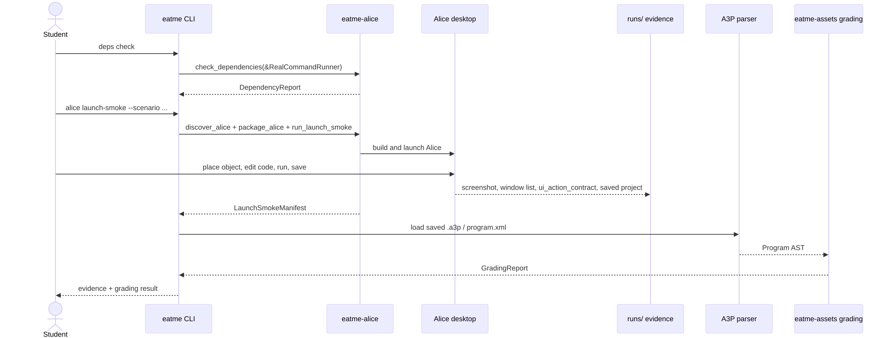
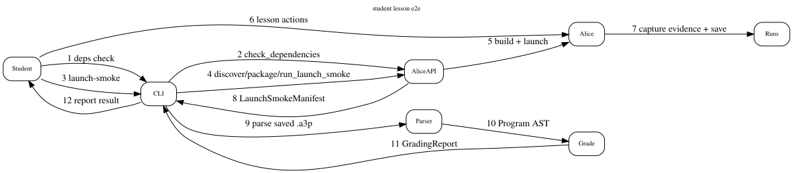
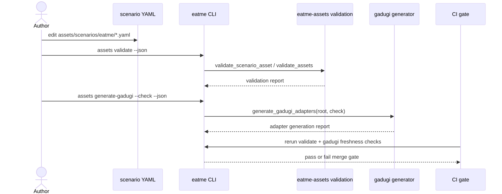
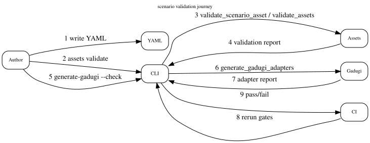
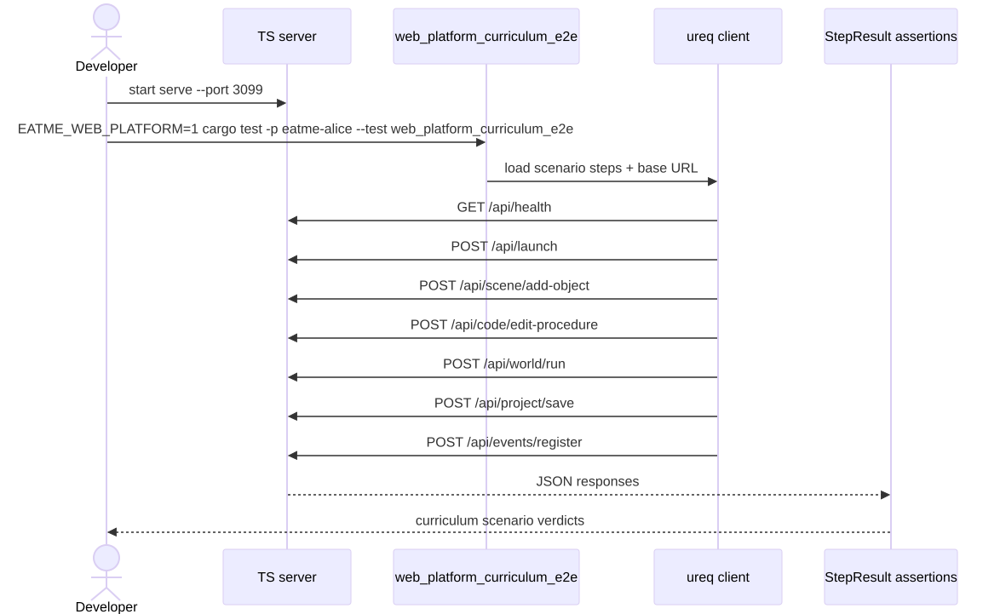
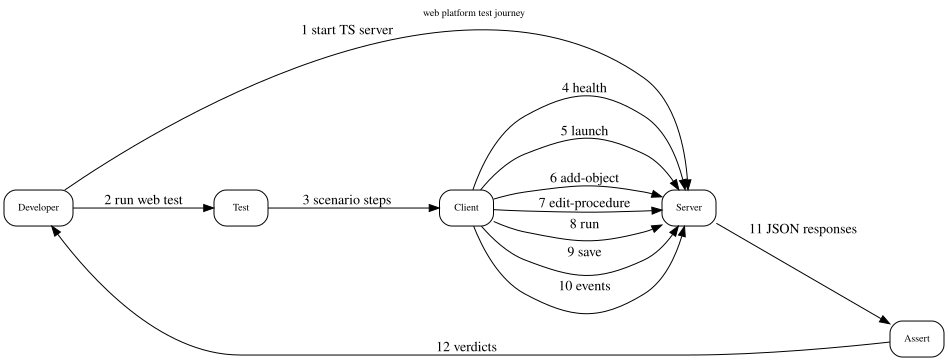
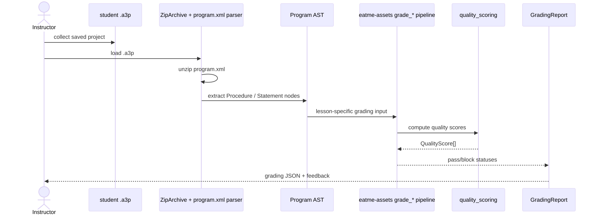
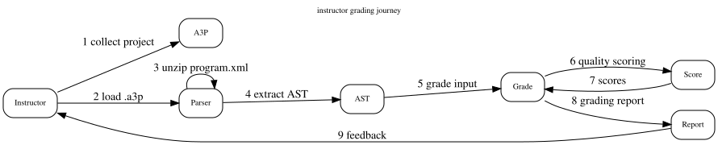
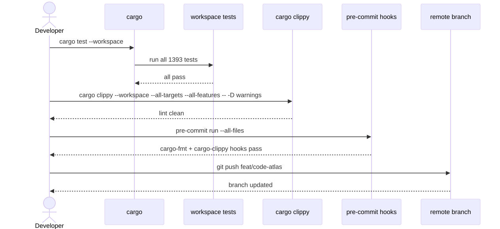
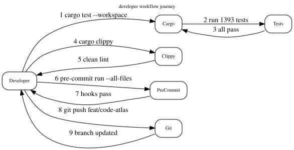

# User Journeys

Behavioral layer 8 traces five end-to-end journeys that connect CLI contracts, launch/grading flows, scenario validation, and developer quality gates.

## 1. Student lesson e2e

## 2. Scenario validation

## 3. Web platform test

## 4. Instructor grading

## 5. Developer workflow

## Source files

- [student-lesson-e2e.mmd](student-lesson-e2e.mmd) / [student-lesson-e2e.dot](student-lesson-e2e.dot)
- [scenario-validation.mmd](scenario-validation.mmd) / [scenario-validation.dot](scenario-validation.dot)
- [web-platform-test.mmd](web-platform-test.mmd) / [web-platform-test.dot](web-platform-test.dot)
- [instructor-grading.mmd](instructor-grading.mmd) / [instructor-grading.dot](instructor-grading.dot)
- [developer-workflow.mmd](developer-workflow.mmd) / [developer-workflow.dot](developer-workflow.dot)
